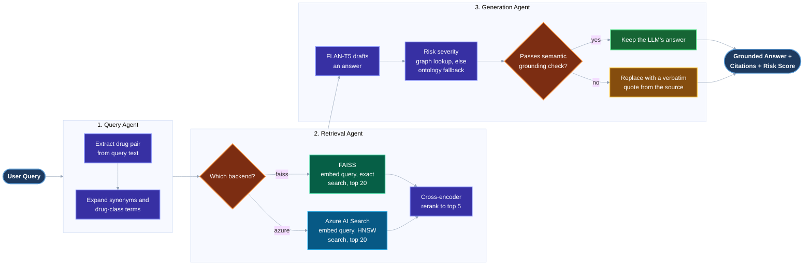

# MediSafe AI

A grounded, retrieval-augmented drug-interaction assistant. Every answer is backed by citations
into a real DrugBank-derived knowledge base, and every metric in this README is produced by the
evaluation scripts checked into this repo, not estimated.

## Architecture

Three agents, orchestrated as a LangGraph state machine.



- **Query Agent** (`backend/local_llm_agent.py`) extracts a drug pair from the query and expands
  it with known synonyms and drug-class terms (`backend/drug_knowledge.py`).
- **Retrieval Agent** performs hybrid retrieval. A bi-encoder (`all-MiniLM-L6-v2`) embeds the
  query and fetches the top 20 candidates from a **swappable vector backend** (FAISS or Azure AI
  Search, chosen at runtime via `RETRIEVAL_BACKEND`), then a cross-encoder
  (`cross-encoder/ms-marco-MiniLM-L-6-v2`) re-ranks them to the final top 5 (`backend/reranker.py`).
- **Generation Agent** generates a grounded explanation with a local FLAN-T5-large model, then
  assesses interaction severity via a drug-interaction graph lookup, falling back to an
  embedding-similarity ontology match when no graph edge exists. Before trusting FLAN-T5's own
  paraphrase, a semantic-similarity confidence check gates it against the retrieved evidence; if
  it isn't well-grounded, the answer is replaced with a verbatim quote from the source document
  instead (a **confidence-gated extractive fallback**). Builds citations and a grounding score.

The whole pipeline is wired through LangGraph (`backend/langgraph_agent.py`) as an explicit
5-node graph with one conditional edge (graph-based risk lookup, falling back to the ontology
match only when the graph has no edge for that pair).

### FAISS and Azure AI Search retrieval backend

Retrieval runs against either a local FAISS index (`backend/data_processor_drugbank.py`, exact
nearest-neighbor search) or Azure AI Search (`backend/azure_search_processor.py`, HNSW
approximate vector search), selected at runtime via `RETRIEVAL_BACKEND=faiss|azure`. Both expose
the identical `search(query, top_k) -> [{id, text, source}]` interface, so nothing downstream
changes when you swap backends. Same embedding model, same document set, on both sides. The
comparison below isolates the vector-store backend as the only variable.

## Real, benchmarked results

### FAISS vs. Azure AI Search retrieval quality

Ran via `backend/run_retrieval_evaluation.py` (unmodified) against both backends, same 8
ground-truth queries, same 11,798-chunk corpus.

| Metric | FAISS (exact) | Azure AI Search (HNSW) |
|---|---|---|
| Precision@5 | 52.5% | 52.5% |
| Recall@5 | 74.0% | 74.0% |
| NDCG@5 | 73.6% | 73.6% |
| MRR | 70.8% | 70.8% |

Identical, verified document-for-document, not just at the aggregate-score level. At this corpus
size (about 11.8K chunks), Azure's approximate HNSW index found the same top-5 neighbors as
FAISS's exact search on every query in the evaluation set.

### Reranking impact

The retrieval comparison above uses raw bi-encoder search with no reranking (that's what
`run_retrieval_evaluation.py` measures). Separately isolating the cross-encoder reranking step
(bi-encoder top-20 to cross-encoder top-5) against the same 8 queries.

| Metric | Bi-encoder only (top-5) | Cross-encoder rerank (20 to 5) |
|---|---|---|
| Precision@5 | 52.5% | 77.5% |
| Recall@5 | 74.0% | 87.5% |
| NDCG@5 | 73.6% | 84.5% |
| MRR | 70.8% | 81.25% |

Verified identical on both backends. Reranking against Azure AI Search produces the same
77.5% / 87.5% / 84.5% / 81.25% as FAISS, not just an assumption from the raw-retrieval parity above.

### End-to-end pipeline (retrieval, reranking, and generation)

Ran the full 3-agent LangGraph pipeline against the same 8 ground-truth queries, CPU-only local
inference.

| Metric | Value |
|---|---|
| Average grounding score | 81.5% |
| Average confidence score | 0.87 (HIGH band) |
| Average semantic grounding | 0.92 |
| Hallucination rate | 0% |
| Extractive fallback triggered | 8/8 queries |
| Average end-to-end latency | 5.8s |

The confidence signal is a semantic-similarity check (same MiniLM encoder used for retrieval)
between each generated sentence and the retrieved evidence it's supposed to be grounded in. When
FLAN-T5's own paraphrase falls below the grounding threshold, the **confidence-gated extractive
fallback** replaces it with a verbatim quote from the top retrieved document instead of showing an
unverified paraphrase.

## Dataset

Parsed from the DrugBank Open Access dataset. It's not redistributed in this repo since DrugBank
requires a license to redistribute their raw XML.

- 500 primary drug entries fully parsed
- 2,188 unique drug names referenced across interaction records
- 11,798 total chunks (general info, clinical info, and pairwise interaction chunks)
- 11,192 pairwise interaction records, with severity classified via embedding-similarity match
  against an S0-S3 clinical-severity rubric (177 major, 1 moderate, 677 minor, 10,337 below
  confidence threshold / unclassified)

`backend/data/chunks_drugbank.json` (FAISS-ready chunks) and
`backend/data/drugbank_interactions.json` (drug-pair graph data, derived from the chunks) are
both checked in so the pipeline runs without needing a DrugBank license.

## Tech stack

- **Retrieval** FAISS (`IndexFlatL2`) / Azure AI Search (HNSW vector search), `sentence-transformers`
- **Reranking** cross-encoder (`ms-marco-MiniLM-L-6-v2`)
- **Generation** FLAN-T5-large (local, no external LLM API required)
- **Orchestration** LangGraph
- **Backend** FastAPI, MongoDB (query history)
- **Frontend** React
- **Deployment** Docker (health-checked), `docker-compose`, EC2 setup script (`deploy/`)
- **Monitoring** rolling p50/p95/p99 latency tracker (`backend/monitoring.py`), exposed at
  `GET /api/metrics`

## Project structure

```
backend/
  local_llm_agent.py          # QueryAgent, RetrievalAgent, GenerationAgent
  langgraph_agent.py          # LangGraph orchestration of the 3 agents
  data_processor_drugbank.py  # FAISS backend (default)
  azure_search_processor.py   # Azure AI Search backend
  reranker.py                 # Cross-encoder reranking + hybrid retrieval
  drug_graph.py                # Drug interaction knowledge graph
  monitoring.py                # Latency tracking middleware
  server.py                    # FastAPI app
  scripts/
    build_interaction_graph_data.py   # Derives drugbank_interactions.json
    upload_to_azure_search.py         # Populates the Azure AI Search index
  run_retrieval_evaluation.py  # Retrieval-only eval harness (precision/recall/NDCG/MRR)
frontend/                      # React UI
deploy/                        # EC2 deployment script
```

## Running it locally

You'll need Node.js 18+, Python 3.11+, MongoDB 7.0+, and Yarn.

```bash
# Terminal 1: MongoDB
mongod --dbpath /data/db   # or brew services start mongodb-community@7.0

# Terminal 2: Backend
cd backend
python -m venv venv && source venv/bin/activate   # Windows venv\Scripts\activate
pip install -r requirements.txt
uvicorn server:app --host 0.0.0.0 --port 8001 --reload

# Terminal 3: Frontend
cd frontend
yarn install
yarn start
```

Open http://localhost:3000 and try "What are the interactions between aspirin and warfarin?"

To use the Azure AI Search backend instead of FAISS, set `AZURE_SEARCH_ENDPOINT`,
`AZURE_SEARCH_API_KEY`, and `AZURE_SEARCH_INDEX_NAME` in `backend/.env`, run
`python scripts/upload_to_azure_search.py` once to populate the index, then set
`RETRIEVAL_BACKEND=azure`.

### Docker

```bash
docker compose up -d --build
curl http://localhost:8001/api/health
```

Or on a fresh EC2 instance, run `bash deploy/ec2_setup.sh`.

## License

MIT. See `LICENSE`.

This project is for educational and research purposes. It is not a substitute for professional
medical advice.
